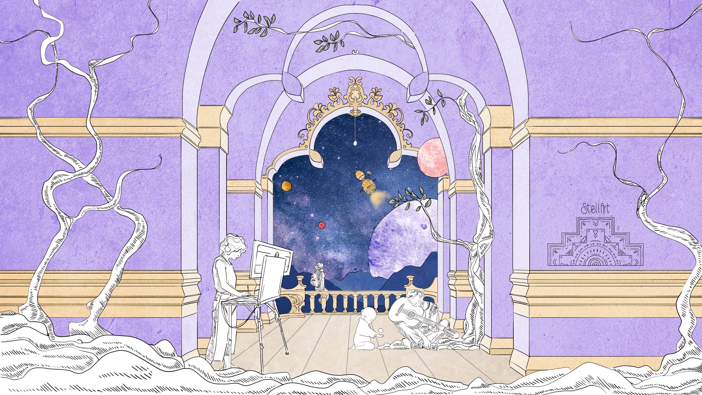
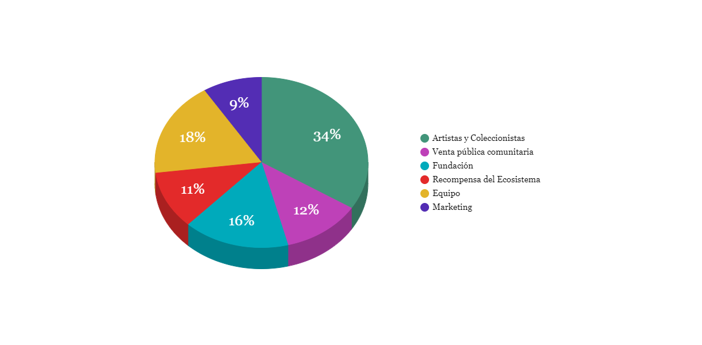
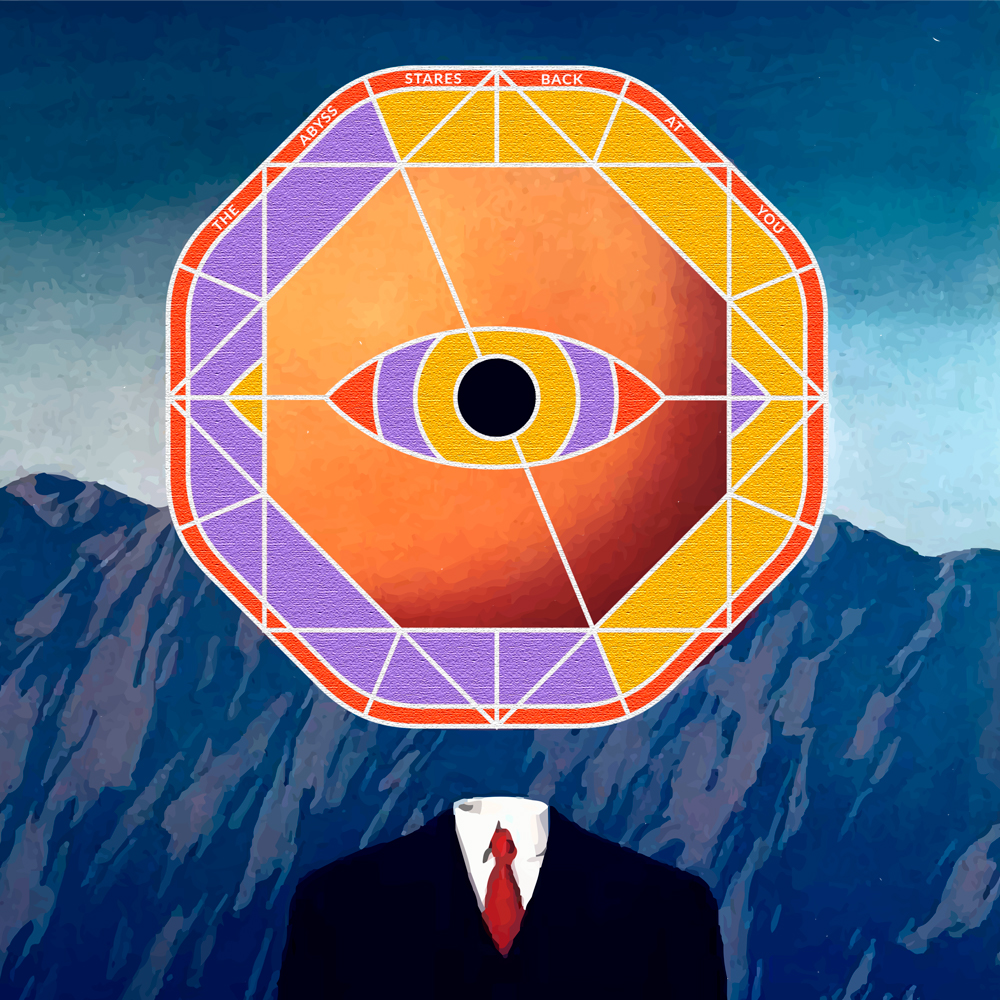

# Nuna Project Art

## **¿Qué es Nuna?**

El **arte** y la **cultura** son parte de nuestra vida y caracterizan a la sociedad en la que vivimos, es importante apoyarlos y asegurarse de que quienes apoyan y trabajan en esta área puedan obtener beneficios. Actualmente muchas personas todavía enfrentan el desafío de vivir con los ingresos que provienen de las obras artísticas.

La digitalización, inteligencia artificial, análisis de big data, Internet de las cosas, realidad aumentada, blockchain y otros grandes desarrollos: todos estos representan la cuarta revolución industrial 4.0.

NUNA es una organización creada por dos artistas emergentes que trabajan con proyectos socio culturales en diferentes especialidades. Hemos trabajo en Grecia, Rumania, España, Italia, Perú en proyectos de desarrollo cultural y artístico. A través de este trabajo nos hemos dado cuenta de la necesidad de poder apoyar a los artistas a través de la blockchain que es para nosotros una tecnología con mucho potencial.

## ¿Quiénes están detrás del proyecto?

Este proyecto es una creación de los artistas y desarrolladores **Ely Colz** y **Munay**, ambos con una amplia experiencia en el mundo de arte.

Los dos se conocieron en Rumania en un proyecto de arte llamado **Art Lab 2.0** trabajando con artistas locales y documentando su realidad, luego continuaron el proyecto en Valencia-España en una startup que trabaja financiando eventos a través de la blockchain, ahí fue donde decidieron crear el proyecto de Nuna Project Art, Iniciaron el proyecto en Julio del 2021 en Grecia trabajando con una organización cultural.

## ¿Por que nace Nuna?

Nuna nació del deseo de compartir y difundir el arte y la cultura, para apoyar el intercambio de arte a través de un token que se entregará a todos los que forman parte del grupo. Queremos con nuestro token dar un bono que agregue un valor al arte que se intercambia y también lo caracteriza, haciendo que cada obra sea parte de un proyecto a largo plazo en continua evolución.

Nuestro objetivo es facilitar el acceso de la comunidad artística a los avances de la ciencia y la tecnología y proporcionar herramientas que permitan la accesibilidad del arte, la educación, la evidencia de procedencia, la digitalización, la protección, el seguimiento, la evaluación y la monetización de los objetos de arte convirtiéndolos en valiosos y activos digitales líquidos.

Nuna es una iniciativa artística que trabaja con la intención de:

* Apoyar la creación, difusión e investigación artística.
* promover el trabajo colaborativo entre artistas de diferentes disciplinas en diversos espacios.
* promocionar  y desarrollar el trabajo de artistas emergentes pertenecientes al colectivo de forma conjunta dentro y fuera de los canales habituales de promoción artística.
* dinamizar la oferta artística de su ciudad de residencia y en la plataformas NFTs.
* desarrollar trabajos de educación del público, a través de workshops y charlas.

## ¿Qué hacemos?

### **Crear una comunidad de artistas, coleccionistas y desarrolladores** 

Una comunidad donde todos puedan ayudarse y crecer mutuamente. Queremos conectar el mundo del arte con la blockchain para que la difusión e intercambio de arte sea más segura y honesta. La blockchain permite prevenir el fraude de obras artísticas, da reconocimiento al autor y deja a un lado a los intermediarios. Queremos propiciar un registro descentralizado que contenga información sobre la veracidad y el camino de la obra de arte.

La digitalización también es la única forma de preservar el arte callejero y convertirlo en arte conceptual digital que sea legal. También es una forma de inmortalizar formas de arte que son temporales por naturaleza, como espectáculos callejeros, espectáculos de improvisación o exhibiciones emergentes. 

### **Preservar el patrimonio cultural**

Patrimonio Cultural sirve de ancla de nuestro pasado y nuestra Historia, nos permite sentirnos parte de ella. Nos otorga identidad y nos permite conocernos mejor socialmente. La cultural y el arte tiene la peculiaridad de educar, permite conocer el pasado y ofrece a la población cierto desarrollo intelectual.

Queremos desarrollar un concepto para un sistema en el que se puede almacenar y compartir versiones digitales de objetos de importancia cultural a través de Stellar Network.

Como funciona:

* Escanear un objeto de importancia cultural para crear una representación virtual del mismo
* Almacenar automáticamente los datos de cada objeto en Stellar Network mediante la utilización del hash
* Convertir a las instituciones como municipalidades, museos y galerías de arte en calidad de operadores de nodos en Stellar Network, donde se puede encontrar la información sobre el patrimonio cultural compartido del país, comunidad o institución, teniendo a la posibilidad de actualizarlo con los datos que manejan a nivel institucional.

Con este proceso la identidad digital de cada objeto considerado patrimonio cultural puede transferirse entre los interesados a un costo muy bajo, honesto, eficaz y promoviendo valores económicos y sociales. 

Casos de monumentos de valor incalculable, que desaparecen sin dejar rastro como resultado de robos, desastres naturales, trastornos políticos o el poder destructivo demuestran la necesidad crucial de crear una base global para un patrimonio cultural digitalizado y de preservar las cosas más preciosas que tenemos como humanidad

### **Certificación digital**

Queremos crear un ecosistema único para diversas soluciones y servicios tecnológicos para el mundo del arte: Una cápsula del tiempo para copias digitales de alta precisión de objetos de arte. Una plataforma confiable de financiamiento colectivo para la preservación del patrimonio cultural mundial. Un contenedor digital adecuado y fácil de usar para cualquier información relacionada con objetos de arte con una carta digital de autenticidad y profunda evidencia de procedencia.

**Cómo funciona:**

* Cada obra de arte está registrada oficialmente y contiene toda la información necesaria sobre su propietario utilizando campos de descripción del sitio especialmente agregados, ya sea una institución de arte o una persona privada. 
* Regular el acceso a la información: el propietario decide qué información debe ser de acceso público.
* Dar a conocer o monetizar la información sobre el objeto de arte convirtiéndolo así en un activo digital: hacer que las piezas de información estén disponibles de manera selectiva, por ejemplo, referencias académicas, artículos, catálogos, guías de audio y video.
* Agregue servicios de terceros: impresión de imágenes, recuerdos, regalos, tienda del museo o ventas de edición limitada, etc.

Hemos realizado una estimación aproximada de cuántos objetos de arte se almacenan actualmente en museos y galerías: en este momento, las instituciones de todo el mundo contienen más de **mil millones de artículos en sus libros**, estanterías y almacenes. La digitalización de la cantidad total requerirá **miles de millones de dólares**. 

**Beneficios:**

* **Carta de autenticidad digital**

Funciona como una carta de autenticidad para obras de arte. Esta nueva categoría de nombres de dominio, en lugar de identificar una organización, empresa o persona, vincula el nombre de dominio de forma única a una obra de arte u objeto de arte. Cada obra de arte está registrada oficialmente por el propietario de un objeto de arte y contiene toda la información necesaria sobre el objeto utilizando campos de descripción del sitio especialmente agregados. Al igual que los certificados de autenticidad fuera de línea contiene el nombre del autor, título, medio, dimensiones, cadena de custodia y otros datos relacionados. Este conjunto de datos se basa en un estándar de J. Paul Getty Trust y está respaldado por Interpol, Scotland Yard, UNESCO y otros organismos autorizados.

* **Seguimiento de procedencia**

Puede establecer y almacenar la cadena de propiedad y los movimientos de un objeto de arte en todo el mundo. Esta tecnología está integrada en el proceso de registro en línea de cada nombre de dominio. Cuanto más profundo sea el historial de procedencia, más valioso será un objeto de arte.

* **Seguimiento del uso de objetos de arte**

Los objetos de arte que utilizan nuestro sistema serán más visibles y más fáciles de rastrear en el espacio en línea, lo que brinda control de cuándo, dónde y cómo se presenta su obra de arte, al tiempo que protege sus derechos de propiedad.

* **La autenticidad es la pieza clave en el coleccionismo de arte** 

Proporciona una prueba de autenticidad para todos: artistas que desean certificar sus obras, propietarios de arte interesados ​​en las decisiones de inversión correctas o amantes del arte que solo necesitan arte verdadero. En la era digital, cada obra de arte debería tener su letra digital de autenticidad.

### NUNA TOKEN

NUNA es una moneda diseñada para el arte en la cadena de bloques Stellar. Esta dirigido al colectivo de artistas, coleccionista, personas e instituciones que colaboran con nuestros proyectos.

#### Para que sirve Nuna Token?

* Moneda de cambio para adquirir arte y servicios culturales,
* Como unidad de cuenta para fijar precios
* Como un depósito de valor, que implica que el token puede guardarse para ser usado posteriormente, lo que hace posible el ahorro y el enriquecimiento.
* Token de recompensa para los usuarios.
* Ayudara al gobierno para el mercado de arte

#### La moneda se creó para ser **libre y descentralizada**:

el proyecto inicio JULIO 2021 con 42 millones de tokens creados en la génesis que mantienen en una cuenta bloqueada, con bandera inmutable y no se crearan más.

Puedes revisarlo aquí:

#### Asset info:

Asset Issuer: [GCKCDIW33...3765S42MG](https://stellar.expert/explorer/public/asset/NUNA-GCKCDIW33T2WBRSYRB7UKSLJMVHSSCW3DYOJ53NCFTQIWZY3765S42MG)

Asset Code: NUNA

Fixed Tokens Supply: 42,000,000

Asset Type: credit\_alphanum4

Decimal: 7

Para ser siempre transparentes, decidimos poner los activos en diferentes direcciones, para que todos tengan la posibilidad de seguir su proceso de distribución.

#### Asignación de activos: Tokenomics NUNA

Artistas y Coleccionistas:  [GCK5…L2IX](https://stellar.expert/explorer/public/account/GCK5K54NA2SPQYRWALMIWU3S62UBR4MGRVDMDBTC2VW6MJ3M4ETNL2IX)

Venta pública comunitaria: [GCKP…WC4B](https://stellar.expert/explorer/public/account/GCKPS2DH2HX3Y5E3GCZ2IFW53DRCQ27MIFXDFOUPHLZD4ZIC4UANWC4B)

Fundación: [GBFA…24TH](https://stellar.expert/explorer/public/account/GBFA5UC5WDZO7XHV3EJHHZU63NS5CLSSHKNV5FIPXYG7N3XGNUMG24TH)

Recompensa del Ecosistema: [GCLL…TX4B](https://stellar.expert/explorer/public/account/GCLLOXOR6F5AR3WB6Z2AK6KAJ6EDZX6PZZVOK4EYARNZOE36CE2ITX4B)

Equipo:  [GABI…ZN43](https://stellar.expert/explorer/public/account/GABIJWXCJJAKWNLRUQLYGBBRDGRMJBJYWZIWOOBXTA532DTEIPIKZN43)

Marketing:  [GB42…S23T](https://stellar.expert/explorer/public/account/GB424BMG65OP6DTJ7VAFLFSHXYFNZYAICYF4EDHABQ7FP6OZLPL4S23T)

## **Ecosistema NUNA**

### Capacidades

* **Convierta obras de arte y artistas en NFT:** NUNA ayudará a convertir obras de arte y artistas en cadena con un solo clic, inyectando nuevos valores a las obras de arte.
* **Redefinir el valor de las obras de arte:** NUNA facilitará precios más justos y transparentes de las obras de arte por
* **Transformar** la forma en que se valoran las obras de arte.
* **Cultivar e incubar artistas de NFT:** NUNA invertirá una gran cantidad de recursos para nutrir a los artistas de NFT y proporcionarles una ruta de desarrollo completa.
* **Apoyar** a artistas e instituciones.
* **Investigación de la industria creativa:** NUNA contratará profesionales para observar y orientar sobre la industria creativa, ayudará y guiará en la curatoria de nuevas obras de arte.
* **Obras de arte y artistas:** NUNA apoya la tokenización de obras de arte y artistas. Las obras de arte tendrán sus propiedades confirmadas y las fuentes rastreadas en la cadena de bloques, donde los usuarios pueden también intercambiarlos.
* **Comunidades:** las comunidades se construyen a través del impacto de los iniciadores, que será un foro para que los entusiastas del arte intercambien ideas y recomienden obras de arte y artistas valiosos a través del autogobierno.
* **Financiar** proyectos culturales, **intercambios**, **talleres** y **talks.**

#### NUNA ES UNA MONEDA DISEÑADA PARA EL INTERCAMBIO ARTISTICO:

es el token de gobernanza para el Ecosistema NUNA. Los titulares de NUNA participan en la gobernanza de NUNA intercambiado y guardando la obras de arte.

